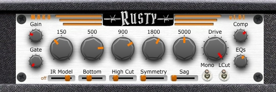

# Mako Rusty
* A demo Juce VST Guitar Amplifier Simulation.
* Sample code.
* Tested on Windows only.
* Written in Visual C++ 2022.
* Written for new programmers, not complicated.
* Version: 1.01
* Posted: July 6, 2024

VERSION
------------------------------------------------------------------
1.00 - Initial release.
1.01 - Added amplifier Sag, Symmetry, and High Cut.

DISCLAIMER
------------------------------------------------------------------  
This VST was written in a very simple way. No object defs, etc. 
Just simple code for people who are not programmers but want to 
dabble in the magic of JUCE VSTs.

If you are new to JUCE code, the Mako Thump VST may be a better
starting place. Or be brave and try this.
       
SUMMARY
------------------------------------------------------------------
A Juce/C++ VST3 written to simulate an older style guitar amplifier. 

# THEORY OF OPERATION 
This VST is designed to mimic a low gain guitar amplifier. It applies an EQ to the guitar signal before it
applies any gain. 

The guitar signal chain thru the VST is:  
Guitar -> Noise Gate -> EQ -> Gain -> High Cut -> Impulse Response Speaker Sim -> Compressor

EQ BEFORE GAIN  
Placing the EQ section before the gain stages gives you full control of the distortion voice. This works best for low to medium gain amplifiers.
Excessive bass and treble into a high gain stage can sound very bad.  

NOTE: Since our EQ circuit adds volume, it can be used to boost distortion.

COMPRESSOR  
Since the VST is trying to duplicate and older style cleanish amp, a compressor was added to bring out the
jingle and allow for close to breakup sounds. 

The single control is for the compressor THRESHOLD. This is the volume the incoming signal must hit to trigger the
compressor. 

A setting of 1.0 (Full On) means the compressor is off and not being used.  

HIGH CUT  
As gain is added there is an increase in upper harmonics. the high cut lets you tame the harsh biting highs.

EQ  
The VST uses a simple 5 band EQ style filter style. There are 11 EQs avaialaibe with varying Cutoff Frequencies (Fc) 
and filter Q's.

GAIN   
The signal gathers gain thru the EQ section. That signal is then sent thru some soft clipping code to add distortion.
The overall distortion is a combination of EQ, Gain, and compressor settings. Amplifier Sag and Symmetry have been added and depending on the setting
they will add strange distortion as well. 

AMPLIFIER SAG  
Amplifier Sag is a setting that will soften fast rising edges of your signal. This effect is trying to simulate when an amplifier is being pushed so hard
that its power supply begins to run out of power. The effect added here is based on a fast recovering circuit. Very fast edges are reduced only to the
point the entire waveform gets heavily distorted.

If the supply was very slow to recover, the effect would sound like a typical compressor. Letting signal thru before it runs out of power and then lowering volume
until it can revcover. In this case, just use a compressor. 

AMPLIFIER ASYMMETRY  
In some Tube circuits a situation can occur where the positive and negative halves of a signal can differ in gain and shape. The effect here gradually reduces
and distorts the negative part of the signal. When added slightly, the effect can soften the tone. When heavily added, distortion will be present. 
